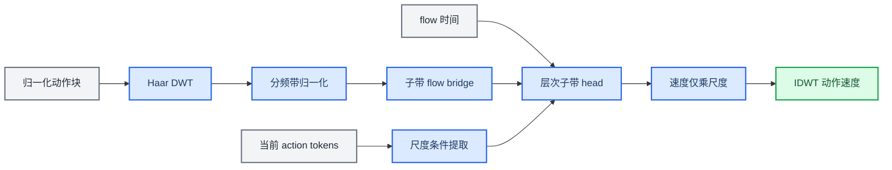

# Plan 1：NH-WaFM 实现说明

_基于 `codex/nh-wafm-plan1` 当前源码与实际测试产物整理；截至 2026-07-28。_

---

## 📋 交付状态

本次实现把新的 `subband_flow` 路径与原始 \(\pi_{0.5}\)、legacy WaFM 并存。训练时的新路径直接在标准化 Haar 子带中构造 flow bridge；推理时维护固定结构的子带状态，并在 ODE 结束后通过 IDWT 重建动作块。

| 项目 | 状态 | 证据 |
| --- | --- | --- |
| 编码前审计 | 已完成 | [`PLAN1_AUDIT.md`](PLAN1_AUDIT.md) |
| 子带统计与归一化 | 已实现并做定向单测 | [`wavelet_normalization.py`](src/openpi/models/wavelet_normalization.py) |
| NH-WaFM head 与 bridge | 已实现并做定向单测 | [`wavelet_flow_head.py`](src/openpi/models/wavelet_flow_head.py) |
| 训练与子带 ODE | 已实现并做 dummy 模型测试 | [`pi0.py`](src/openpi/models/pi0.py) |
| checkpoint 部分加载 | 已实现并做定向单测 | [`model.py`](src/openpi/models/model.py)、[`weight_loaders.py`](src/openpi/training/weight_loaders.py) |
| 400 步小数据 overfit | 已通过 | [`wavelet_overfit.json`](plan1_results/wavelet_overfit/wavelet_overfit.json) |
| LIBERO 阶段 1 公平配置 | 已注册，待服务器实跑 | [`config.py`](src/openpi/training/config.py)、[`config_test.py`](src/openpi/training/config_test.py) |
| LIBERO/CALVIN/RoboTwin 完整实验 | 未执行 | 见 [`PLAN1_LIMITATIONS.md`](PLAN1_LIMITATIONS.md) |

> ⚠️ **范围说明：** “已实现”表示源码路径和定向测试存在，不表示已经获得机器人任务成功率提升。完整 benchmark 结果仍为空，不能由合成 overfit 结果替代。

## 🏗️ 三种兼容模式

| 模式 | 核心配置 | flow bridge 所在域 | 推理状态 | 旧行为 |
| --- | --- | --- | --- | --- |
| 原始 \(\pi_{0.5}\) | `use_wavelet_flow_head=false` | 动作域 | 动作域 \(x_t\) | 保留 |
| legacy WaFM | `use_wavelet_flow_head=true`、`wavelet_flow_impl="legacy_head"` | 动作域 | 动作域 \(x_t\) | 保留，仍用原 `WaveletSubbandFlowHead` |
| NH-WaFM | `use_wavelet_flow_head=true`、`wavelet_flow_impl="subband_flow"` | 标准化小波子带域 | 固定 tuple 子带状态 | 新增 |

`wavelet_flow_impl` 的默认值是 `legacy_head`。因此旧配置即使启用了 wavelet head，也不会在未显式修改配置时切换到 NH-WaFM。

新路径的数据关系如下。动作 expert 仍处理当前动作块，不加入历史 memory；其 token 仅通过尺度 pooling 或 band query 提供当前块条件。



## 📐 小波域概率路径

### DWT、padding 与 shape

给定动作块 \(a\in\mathbb{R}^{B\times H\times A}\)，实现复用现有正交 Haar 变换。有效层数会对短 horizon 做静态裁定：

\[
L_{\mathrm{eff}}
=
\min\left(L,\left\lceil\log_2 H\right\rceil\right).
\]

完整时间轴只做一次 edge padding：

\[
P
=
\left\lceil\frac{H}{2^{L_{\mathrm{eff}}}}\right\rceil
\cdot 2^{L_{\mathrm{eff}}}.
\]

实际代码按等价整数公式计算 \(P\)。对应 shape 为：

\[
A_L:\ [B,P/2^L,A],\qquad
D_i:\ [B,P/2^i,A].
\]

代码内部的 detail 存储顺序固定为 `(D1, D2, ..., DL)`，而 head 的预测顺序固定为 `A_L -> D_L -> ... -> D1`。IDWT 完成后裁剪为原始 \(H\)。

### 分频带归一化

真实动作先经过 OpenPI 原有 `norm_stats` 归一化，再计算 Haar 子带：

\[
z_b^{data}=W_b(a),\qquad
\widetilde z_b^{data}
=
\frac{z_b^{data}-\mu_b}{\sigma_b+\epsilon}.
\]

JSON 统计文件保存 `A_L, D_L, ..., D1` 的逐动作维度 mean/std。模型变量内部按 `A, D1, ..., DL` 排列；加载器会校验 levels、action dimension、horizon、padding 元数据和有限值。

状态反归一化为：

\[
z_b=(\sigma_b+\epsilon)\widetilde z_b+\mu_b.
\]

速度反归一化则只能使用尺度：

\[
u_b=(\sigma_b+\epsilon)\widetilde u_b.
\]

速度路径不添加均值。该区别由 `test_wavelet_velocity_denormalization` 和 band-query head 测试覆盖。

### 子带 flow bridge

NH-WaFM 不先在动作域构造 \(x_t\)。真实子带归一化后，与子带噪声直接插值：

\[
\widetilde z_b^t
=(1-t)\widetilde z_b^{data}
+t\widetilde z_b^{noise},
\qquad
u_b
=
\widetilde z_b^{noise}
-\widetilde z_b^{data}.
\]

canonical 设置 `wavelet_shared_noise=false`，直接为每个标准化子带独立采样同 shape 的 \(N(0,I)\)。`true` 仅作为共享噪声消融：先在完整 padded action horizon 上采样一个物理动作域高斯张量，做正交 Haar DWT，再用训练数据的 band mean/std 映射到同一标准化子带坐标。两种方式均在子带 bridge 中构造路径，但其噪声先验不同，实验记录必须显式区分。

## 🧠 层次 head 与 action expert 条件

### 粗到细耦合

`NormalizedHierarchicalWaveletFlowHead` 使用轻量 FiLM MLP，并显式接收三维时间特征：

\[
[t,\sin(\pi t),\cos(\pi t)].
\]

近似带首先预测：

\[
\widehat u_A=f_A(\widetilde z_A^t,h_A,t).
\]

随后从粗到细预测 detail：

\[
\widehat u_{D_i}
=f_{D_i}
\left(
\widetilde z_{D_i}^t,
h_{D_i},
\operatorname{up}(\widehat u_A),
\operatorname{up}(\widehat u_{D_{i+1}}),
t
\right).
\]

`wavelet_hierarchical_coupling=false` 时，两个 coarse condition slot 均置零，形成独立子带消融。`wavelet_detach_coarse_condition=true` 时，粗带预测经过 `jax.lax.stop_gradient` 后再提供给细带。

### Temporal pooling

`wavelet_conditioning_mode="temporal_pooling"` 会先把 action token edge-pad 到与动作块相同的 padded horizon，再按目标子带长度做平均池化。该路径没有对 action token 做固定 Haar DWT。

### Band query

`wavelet_conditioning_mode="band_query"` 为 `A, D1, ..., DL` 分别建立最多 4 个可学习 query，以单头轻量 cross-attention 从当前动作块 token 提取条件，再静态映射到对应 band 时间长度。它不读取历史动作块，也不修改 PaliGemma 主干。

### Gate

legacy gate 参数保留用于旧 checkpoint 和消融。NH-WaFM head 的 `wavelet_gates` 固定为 `None`；新增 smoke 配置也将 gate 及其稀疏/监督损失关闭。

## ⚙️ 配置参考

主要配置定义在 [`pi0_config.py`](src/openpi/models/pi0_config.py)。新增与相关字段如下：

| 配置项 | 默认值 | 作用 |
| --- | --- | --- |
| `wavelet_flow_impl` | `"legacy_head"` | 在 legacy 与 NH-WaFM 间显式选择 |
| `wavelet_levels` | `3` | 请求的 Haar 分解层数 |
| `wavelet_band_normalization` | `false` | 是否加载并应用子带统计 |
| `wavelet_band_norm_eps` | `1e-6` | 近零方差保护 |
| `wavelet_norm_stats_path` | `null` | 子带统计 JSON 路径 |
| `wavelet_norm_stats_fallback` | `"error"` | 缺失统计时 `error` 或显式 `identity` |
| `wavelet_hierarchical_coupling` | `false` | 是否启用粗到细条件 |
| `wavelet_shared_noise` | `false` | 独立标准化子带 \(N(0,I)\)；`true` 为共享动作噪声消融 |
| `wavelet_band_loss_weights` | `null` | `A_L,D_L,...,D1` 顺序的权重 |
| `wavelet_detach_coarse_condition` | `false` | 是否截断 coarse condition 梯度 |
| `wavelet_use_action_reconstruction_loss` | `false` | 是否加入动作域速度重建项 |
| `wavelet_use_cross_band_consistency` | `false` | 是否加入可解释的能量份额一致性项 |
| `wavelet_cross_band_consistency_weight` | `0.0` | 跨频带一致性权重 |
| `wavelet_conditioning_mode` | `"temporal_pooling"` | `temporal_pooling` 或 `band_query` |

已注册的 `debug_nh_wafm` 使用 dummy PaliGemma/action expert、horizon 10、level 2、层次 coupling 和 temporal pooling，用于假数据 smoke，而不是完整 benchmark 配置。

[`configs/plan1_experiments.json`](configs/plan1_experiments.json) 给出阶段 1–4 的参数矩阵。JSON 本身不被 `openpi.training.config.cli()` 自动解析，但阶段 1 已注册以下四个命名 `TrainConfig`：

| 实验 | 训练与评测配置名 | 唯一变化 |
| --- | --- | --- |
| 原始 \(\pi_{0.5}\) | `plan1_pi05_libero_baseline` | 不启用 wavelet head |
| legacy WaFM level 2 | `plan1_legacy_wafm_l2` | 动作域 bridge 与 legacy head |
| 子带 flow、无频带归一化 | `plan1_subband_l2_no_norm` | 真正子带 bridge |
| 子带 flow、有频带归一化 | `plan1_subband_l2_norm` | 在上一项基础上启用 band stats |

四个配置通过同一 helper 固定 LIBERO 数据、动作 `norm_stats`、base checkpoint、优化器、EMA、seed、batch size 和训练步数。阶段 2/3 仍未注册，必须等阶段 1 门槛通过后再继续。服务器命令见 [`PLAN1_SERVER_RUNBOOK.md`](PLAN1_SERVER_RUNBOOK.md)。

## 📊 训练损失与日志

### 损失

基础子带损失按 coarse-to-fine 配置权重求和：

\[
\mathcal L_{\mathrm{band}}
=
\sum_b \lambda_b
\operatorname{MSE}
\left(\widehat u_b,u_b\right).
\]

动作域项先按“速度仅乘 std”反归一化，再 IDWT：

\[
\mathcal L_{\mathrm{action}}
=
\operatorname{MSE}
\left(
W^{-1}(S\widehat u),
W^{-1}(Su)
\right),
\]

其中 \(S_b=\sigma_b+\epsilon\)。

可选跨频带项先把标准化预测与目标速度按 band std 还原为物理小波速度 \(\bar u_b=(\sigma_b+\epsilon)\widetilde u_b\)，再比较能量份额。对每个 band：

\[
E_b=\sum_{\tau,d}\bar u_{b,\tau,d}^2,\qquad
p_b=\frac{E_b}{\sum_jE_j+10^{-8}},
\]

\[
\mathcal L_{\mathrm{cross}}
=
\operatorname{mean}_b
\left(\widehat p_b-p_b\right)^2.
\]

这里使用系数平方和而不是各 band 的均值，避免不同时间长度的 band 被错误地等权。对 padded horizon 上的正交 Haar 变换，所有 band 的平方和对应同一物理动作速度的平方能量，即 Parseval 关系；因此该项衡量的是可解释的物理频带能量分配。日志中的 `band_target_energy_*` 与 `band_pred_energy_*` 仍是标准化 band 的均方值，不能与该 cross loss 内部的物理平方和混为一谈。

因此总损失为：

\[
\mathcal L
=
\mathcal L_{\mathrm{band}}
+\lambda_{\mathrm{action}}\mathcal L_{\mathrm{action}}
+\lambda_{\mathrm{cross}}\mathcal L_{\mathrm{cross}}.
\]

`lambda_wavelet_flow_loss` 继续服务 legacy WaFM；NH-WaFM 的基础 band loss 不依赖该 legacy 权重。

### 记录字段

NH-WaFM 返回或记录：

- `loss_band_A`、`loss_band_D1`、`loss_band_D2` 等
- `band_target_energy_A`、`band_target_energy_D1` 等
- `band_pred_energy_A`、`band_pred_energy_D1` 等
- `loss_band_total`
- `loss_action_reconstruction`
- `loss_cross_band_consistency`
- `gradient_norm_each_band_head_A`
- `gradient_norm_each_band_head_D1`、`gradient_norm_each_band_head_D2` 等

梯度范数由 [`scripts/train.py`](scripts/train.py) 按 head 参数路径过滤后记录。

## 🔄 小波域 ODE 推理

`subband_flow` 采样流程为：

1. 初始化标准化 `A_L` 与固定长度 detail tuple
2. 预计算一次 prefix KV cache
3. 在每个 Euler step 中把当前子带状态反归一化并 IDWT，生成 action expert 当前 token 输入
4. 按 `A_L -> D_L -> ... -> D1` 预测标准化速度
5. 对所有子带执行 \(z\leftarrow z+\Delta t\,u\)，其中 \(\Delta t=-1/N\)
6. 循环结束后做状态反归一化、IDWT 与 horizon 裁剪

`jax.lax.while_loop` carry 固定为 `(approx, tuple(details), time)`。循环中没有增长中的 Python list；每个 detail 的 shape 在 model construction 时静态确定。定向测试覆盖 batch size 1 和 `num_steps=1/5/10`，并检查输出有限。

## 💾 checkpoint 兼容

### 允许的部分初始化

训练初始化与推理加载只允许以下路径在旧 checkpoint 中缺失：

- 路径包含 `wavelet_flow_head`
- 路径包含 `lora`

这些缺失叶子保留新模型的初始化值，并逐项输出 warning。checkpoint 中只存在、当前模型中不存在的叶子，在允许删除 extra 参数的路径中也会逐项 warning 后删除。

### 仍然严格报错的情况

- 任意共享参数 shape 不一致
- 任意非 `lora`、非 `wavelet_flow_head` 的必要参数缺失
- `remove_extra_params=false` 时出现 checkpoint-only 参数

因此：

- 原始 \(\pi_{0.5}\) checkpoint 可用于启动 NH-WaFM 新训练，新增 head 明确初始化
- 原始 \(\pi_{0.5}\) checkpoint 用原始配置加载时不创建 wavelet head
- legacy WaFM checkpoint 用 `wavelet_flow_impl="legacy_head"` 继续评测
- NH-WaFM checkpoint 必须用完全匹配的 levels、conditioning 与 head shape

Orbax `--resume` 仍面向相同完整训练状态。把旧架构迁移到 NH-WaFM 时应启动新 run 并使用 `CheckpointWeightLoader`，不能把旧 optimizer tree 当作 NH-WaFM 的原地 resume。

## 🔧 统计、训练与评测命令

### 计算 wavelet 统计

先只用原始 `pi05_libero` 计算一次 OpenPI 动作统计，四个阶段 1 配置都显式读取这一个目录：

```bash
uv run scripts/compute_norm_stats.py --config-name pi05_libero
```

随后使用目标 norm 配置从完整训练 data loader 计算 level 2 统计。脚本不会实例化模型，会优先把结果写到该模型配置的 `wavelet_norm_stats_path`：

```bash
uv run scripts/compute_wavelet_norm_stats.py \
  --config-name plan1_subband_l2_norm \
  --levels 2 \
  --num-batches 1000 \
  --eps 1e-6
```

脚本固定使用 `skip_norm_stats=false`，并在 data config 未加载动作 `norm_stats` 时立即报错，因此读取的是已经经过 OpenPI normalization 和 model transform 的动作。统计文件必须与训练的 dataset、action horizon、action dimension、padding 和 levels 一致。

### Smoke 与 overfit

注册的假数据 smoke：

```bash
uv run scripts/train.py debug_nh_wafm --exp-name=debug_nh_wafm --overwrite
```

可重复的 CPU 小数据门槛：

```bash
PYTHONPATH=src JAX_PLATFORMS=cpu \
uv run scripts/run_wavelet_overfit.py \
  --output-dir plan1_results/wavelet_overfit \
  --steps 400 \
  --log-interval 100
```

PowerShell 可先设置：

```powershell
$env:PYTHONPATH = "src"
$env:JAX_PLATFORMS = "cpu"
uv run scripts/run_wavelet_overfit.py --output-dir plan1_results/wavelet_overfit --steps 400 --log-interval 100
```

### 真实训练

阶段 1 使用已经注册的四个配置之一运行：

```bash
XLA_PYTHON_CLIENT_MEM_FRACTION=0.9 \
uv run scripts/train.py <stage1_config> \
  --exp-name=<experiment_name> \
  --overwrite
```

不要只在训练命令中临时覆盖 NH-WaFM 架构而不注册名称。评测服务通过配置名重新创建模型，若配置名仍指向原始 \(\pi_{0.5}\)，checkpoint tree 将与模型不匹配。

### LIBERO 评测

服务端必须使用训练时同一个命名配置：

```bash
uv run scripts/serve_policy.py policy:checkpoint \
  --policy.config=<stage1_config> \
  --policy.dir=checkpoints/<stage1_config>/<experiment_name>/<step>
```

然后在安装好 LIBERO 依赖的客户端环境运行：

```bash
python examples/libero/main.py
```

当前仓库没有与 LIBERO client 等价的完整 CALVIN benchmark driver，也没有现成 RoboTwin experiment；本交付不提供虚构命令。

## ✅ 定向测试与真实结果

定向测试实际使用 Python `3.12.7` 隔离环境；核心依赖版本为 JAX `0.5.3`、Flax `0.10.2`、NumPy `1.26.4`、Optax `0.2.4`、Orbax `0.11.13`。项目声明 Python `>=3.11`，但 RLDS 可选依赖仍应按仓库审计要求使用 Python `3.11`。以下是本次实际执行过的定向结果，不代表整个仓库测试套件。

| 范围 | 实际结果 | 覆盖重点 |
| --- | ---: | --- |
| `wavelet_flow_head_test.py` + `wavelet_normalization_test.py` | 16 passed | Haar 解析值与 roundtrip、shape、归一化、速度反归一化、bridge、层次梯度语义、两种条件 head |
| NH-WaFM 非有限配置校验 | 4 passed | epsilon、band weight、cross weight、reconstruction weight 拒绝 NaN |
| `weight_loaders_test.py` | 4 passed | 可选参数初始化、extra 日志、必要参数缺失、shape mismatch |
| NH-WaFM model 定向测试 | 4 passed | 1/5/10 步采样、forward/backward 无 NaN/Inf |
| legacy mode 定向测试 | 1 passed | legacy loss 字段与采样 shape 不变 |
| 阶段 1 配置与统计脚本测试 | 待服务器执行 | 四配置公平性、manifest 映射、动作统计缺失拒绝、输出路径一致性 |

`scripts/train.py debug_nh_wafm` 也曾在本隔离环境中尝试启动，但因该临时环境没有安装项目锁定的 `lerobot` 依赖而在导入 `openpi.training.data_loader` 时停止，尚未进入 `train_step`。因此本表不把 debug 训练循环、梯度日志或 checkpoint save 记为已通过。

对应测试入口：

```bash
PYTHONPATH=src JAX_PLATFORMS=cpu uv run pytest -q \
  src/openpi/models/wavelet_flow_head_test.py \
  src/openpi/models/wavelet_normalization_test.py

PYTHONPATH=src JAX_PLATFORMS=cpu uv run pytest -q \
  src/openpi/training/weight_loaders_test.py

PYTHONPATH=src JAX_PLATFORMS=cpu uv run pytest -q \
  src/openpi/models/model_test.py \
  -k "subband_sampling_one_step or no_nan_forward_backward or legacy_mode_unchanged"
```

### 400 步 overfit

该实验训练真实 `NormalizedHierarchicalWaveletFlowHead`，但只使用固定合成动作批次、固定 action token 和两层 Haar，未运行 PaliGemma。

| 指标 | step 0 | step 400 | final / initial |
| --- | ---: | ---: | ---: |
| `loss_total` | 2.493743 | 0.012869 | 0.0052 |
| `loss_band_A` | 2.701014 | 0.006562 | 0.0024 |
| `loss_band_D1` | 2.598769 | 0.028478 | 0.0110 |
| `loss_band_D2` | 2.181447 | 0.003566 | 0.0016 |
| `action_idwt_mse` | 1.261985 | 0.005659 | 0.0045 |

门槛要求所有 band loss 与 `action_idwt_mse` 的 final/initial 不高于 `0.5`，实际状态为 `passed`。完整轨迹在 [`wavelet_overfit_history.csv`](plan1_results/wavelet_overfit/wavelet_overfit_history.csv)，原始配置和全精度数值在 [`wavelet_overfit.json`](plan1_results/wavelet_overfit/wavelet_overfit.json)。

这一结果只解除“子带 head 在固定小数据上完全无法拟合”的止损条件；它不证明端到端动作误差、任务成功率或多随机种子收益。

## 🔍 文件索引

| 文件 | 作用 |
| --- | --- |
| [`src/openpi/models/wavelet_flow_head.py`](src/openpi/models/wavelet_flow_head.py) | Haar、bridge、temporal pooling、band query、层次 head |
| [`src/openpi/models/wavelet_normalization.py`](src/openpi/models/wavelet_normalization.py) | 统计 schema、加载校验、状态/速度归一化 |
| [`src/openpi/models/pi0.py`](src/openpi/models/pi0.py) | 三模式训练与采样分支 |
| [`src/openpi/models/pi0_config.py`](src/openpi/models/pi0_config.py) | 新配置字段与校验 |
| [`scripts/compute_wavelet_norm_stats.py`](scripts/compute_wavelet_norm_stats.py) | 离线子带统计 |
| [`scripts/compute_wavelet_norm_stats_test.py`](scripts/compute_wavelet_norm_stats_test.py) | 动作统计前置条件与输出路径测试 |
| [`scripts/run_wavelet_overfit.py`](scripts/run_wavelet_overfit.py) | 合成小数据止损门槛 |
| [`scripts/train.py`](scripts/train.py) | per-band head 梯度范数日志 |
| [`src/openpi/training/config_test.py`](src/openpi/training/config_test.py) | 阶段 1 公平性与 manifest 一致性测试 |
| [`configs/plan1_experiments.json`](configs/plan1_experiments.json) | 分阶段实验参数矩阵 |
| [`PLAN1_SERVER_RUNBOOK.md`](PLAN1_SERVER_RUNBOOK.md) | 服务器安装、统计、smoke、短跑与评测门槛 |
| [`PLAN1_EXPERIMENT_RESULTS.csv`](PLAN1_EXPERIMENT_RESULTS.csv) | benchmark 结果汇总表 |
| [`PLAN1_LIMITATIONS.md`](PLAN1_LIMITATIONS.md) | 尚未验证事项与止损边界 |
