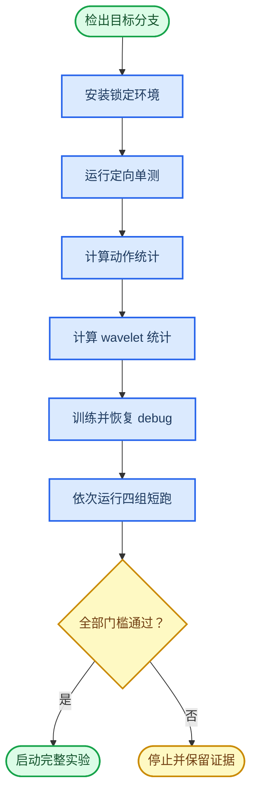

# Plan 1：服务器验证运行手册

_适用于 `codex/nh-wafm-plan1` 分支 · JAX/Flax NNX 路径 · 最后按源码核对：2026-07-28_

---

## 📋 目标与边界

本手册把服务器验证拆成可停止的门槛：环境与单测、动作统计、wavelet 统计、debug 训练与恢复、四配置短跑、checkpoint 推理、最后才是完整训练。当前本地 Windows 环境没有项目锁定的 `uv`、JAX 与 LeRobot 依赖，因此下列 GPU、真实数据和 checkpoint 命令尚未在本地执行；服务器输出才是最终验证证据。

阶段 1 已注册四个公平配置：

| 顺序 | 配置名 | 研究变量 |
| ---: | --- | --- |
| 1 | `plan1_pi05_libero_baseline` | 原始 \(\pi_{0.5}\) |
| 2 | `plan1_legacy_wafm_l2` | legacy WaFM，level 2 |
| 3 | `plan1_subband_l2_no_norm` | 真正子带 flow，不使用 band stats |
| 4 | `plan1_subband_l2_norm` | 真正子带 flow，使用 band stats |

四者共用 `physical-intelligence/libero`、OpenPI 动作 `norm_stats`、\(\pi_{0.5}\) base checkpoint、seed 42、batch size 256、优化器、EMA 和 30,000 步预算。不要用旧的 `libero_full_wafm_l2_nogate_loss` 代替阶段 1 legacy 配置；它的数据路径和 batch size 不同。

### 验证门控



## 🧰 前置条件

| 项目 | 要求 | 检查命令 |
| --- | --- | --- |
| 操作系统 | Linux x86_64 | `uname -a` |
| Python | 3.11 | `python3.11 --version` |
| 环境管理 | `uv` 可用 | `uv --version` |
| GPU | NVIDIA GPU 与驱动可见 | `nvidia-smi` |
| Git | 可访问 GitHub 与 submodule | `git --version` |
| 数据与权重 | 可访问 Hugging Face 数据和 GCS checkpoint | 在统计与 smoke 步骤实际验证 |
| 磁盘 | 能保存数据缓存、四组 checkpoint 和视频 | `df -h` |

所有命令默认从仓库根目录运行。若服务器使用调度器，先申请与正式训练相同型号的 GPU 做 smoke；不要在登录节点启动训练。

## 🔧 环境与源码

### 1. 检出推送分支

全新目录：

```bash
git clone https://github.com/Ruyi231/Wafm.git
cd Wafm
git fetch origin
git checkout codex/nh-wafm-plan1
git pull --ff-only origin codex/nh-wafm-plan1
git submodule update --init --recursive
```

已有 checkout：

```bash
git fetch origin
git checkout codex/nh-wafm-plan1
git pull --ff-only origin codex/nh-wafm-plan1
git submodule update --init --recursive
```

确认分支和源码状态：

```bash
git branch --show-current
git status --short
git log -1 --oneline
```

预期分支为 `codex/nh-wafm-plan1`，`git status --short` 没有输出。把 `git log -1 --oneline` 的结果保存到实验记录。

### 2. 创建锁定环境

```bash
uv venv --python 3.11
uv sync --frozen
```

验证核心依赖与设备：

```bash
uv run python -c "import jax, flax, numpy, orbax.checkpoint; print('jax', jax.__version__, 'flax', flax.__version__, 'numpy', numpy.__version__); print(jax.devices())"
```

预期至少打印一个 JAX 设备。正式 GPU smoke 前，设备列表必须包含目标 GPU；若只显示 CPU，不要继续训练。

### 3. 核对命名配置

```bash
uv run python -c "from openpi.training import config; names=['plan1_pi05_libero_baseline','plan1_legacy_wafm_l2','plan1_subband_l2_no_norm','plan1_subband_l2_norm']; print([(name, config.get_config(name).model.wavelet_flow_impl, config.get_config(name).model.wavelet_band_normalization) for name in names])"
```

预期顺序为：

```text
plan1_pi05_libero_baseline -> legacy_head, False（wavelet head 关闭）
plan1_legacy_wafm_l2       -> legacy_head, False
plan1_subband_l2_no_norm   -> subband_flow, False
plan1_subband_l2_norm      -> subband_flow, True
```

## 🧪 单测与合成门槛

### 4. 运行阶段 1 配置测试

```bash
PYTHONPATH=src JAX_PLATFORMS=cpu \
uv run pytest -q \
  src/openpi/training/config_test.py \
  scripts/compute_wavelet_norm_stats_test.py
```

必须全部通过。这两个文件锁定共享 dataset/assets、batch、优化器、base checkpoint、seed、步数、四个消融边界、动作统计前置条件和 wavelet stats 输出路径。

### 5. 重跑 Plan 1 定向测试

```bash
PYTHONPATH=src JAX_PLATFORMS=cpu \
uv run pytest -q \
  src/openpi/models/wavelet_flow_head_test.py \
  src/openpi/models/wavelet_normalization_test.py

PYTHONPATH=src JAX_PLATFORMS=cpu \
uv run pytest -q src/openpi/training/weight_loaders_test.py

PYTHONPATH=src JAX_PLATFORMS=cpu \
uv run pytest -q \
  src/openpi/models/model_test.py \
  -k "subband_sampling_one_step or no_nan_forward_backward or legacy_mode_unchanged"
```

随后重跑 400 步固定合成批次：

```bash
PYTHONPATH=src JAX_PLATFORMS=cpu \
uv run scripts/run_wavelet_overfit.py \
  --output-dir plan1_results/server_validation/wavelet_overfit \
  --steps 400 \
  --log-interval 100
```

打开生成的 `wavelet_overfit.json`，确认 `status` 为 `passed`，且 `loss_band_A`、`loss_band_D1`、`loss_band_D2` 与 `action_idwt_mse` 的 final/initial 均不高于 `0.5`。任一项失败时停止，不计算大规模统计、不启动真实训练。

## 📊 统计文件

### 6. 计算共享动作 `norm_stats`

四个新配置都显式复用 `pi05_libero` 的动作统计目录，所以只计算一次：

```bash
uv run scripts/compute_norm_stats.py --config-name pi05_libero
```

确认文件存在且非空：

```bash
test -s assets/pi05_libero/physical-intelligence/libero/norm_stats.json
ls -lh assets/pi05_libero/physical-intelligence/libero/norm_stats.json
```

如果训练日志出现 `Norm stats not found ... skipping`，立即停止。没有动作归一化时计算出的 wavelet stats 不可用于本实验。

### 7. 计算 level 2 wavelet stats

使用目标 norm 配置读取相同的、已经归一化的动作。统计脚本不会实例化模型，并会优先使用模型配置中的输出路径：

```bash
uv run scripts/compute_wavelet_norm_stats.py \
  --config-name plan1_subband_l2_norm \
  --levels 2 \
  --num-batches 1000 \
  --eps 1e-6
```

严格加载并核对 metadata：

```bash
uv run python -c "from openpi.models.wavelet_normalization import load_wavelet_norm_stats as load; path='./assets/pi05_libero/physical-intelligence/libero/wavelet_norm_stats_l2.json'; stats=load(path, expected_levels=2, expected_action_dim=32, eps=1e-6, expected_action_horizon=10); print(stats.to_dict()['metadata']); print(list(stats.bands))"
```

必须满足：

- `source_config` 为 `plan1_subband_l2_norm`
- `requested_levels=2` 且 `levels=2`
- `action_horizon=10` 且 `padded_horizon=12`
- `action_dim=32`
- `identity=false` 且 `sample_count>0`
- band 顺序为 `A_2, D_2, D_1`
- 所有 mean/std 为有限值，std 由运行时 epsilon 保护

不要提交数据相关的统计文件到 Git；记录其 SHA-256 以便复现：

```bash
sha256sum \
  assets/pi05_libero/physical-intelligence/libero/norm_stats.json \
  assets/pi05_libero/physical-intelligence/libero/wavelet_norm_stats_l2.json
```

## ⚙️ 训练与 checkpoint smoke

### 8. 运行 debug 训练

先验证完整 `train_step`、JIT、梯度日志和 checkpoint 保存：

```bash
XLA_PYTHON_CLIENT_MEM_FRACTION=0.9 \
uv run scripts/train.py debug_nh_wafm \
  --exp-name=server_smoke \
  --overwrite
```

默认 10 步结束后应出现：

```text
checkpoints/debug_nh_wafm/server_smoke/9
```

日志必须包含 `loss_band_A`、`loss_band_D2`、`loss_band_D1`、各 band target/pred energy、`loss_action_reconstruction` 和各 band head gradient norm，且数值均为有限值。

### 9. 验证 checkpoint resume

在同一架构上从 10 步恢复到 12 步：

```bash
XLA_PYTHON_CLIENT_MEM_FRACTION=0.9 \
uv run scripts/train.py debug_nh_wafm \
  --exp-name=server_smoke \
  --num-train-steps=12 \
  --resume \
  --no-overwrite
```

预期恢复已有状态，并生成最终 step 目录 `checkpoints/debug_nh_wafm/server_smoke/11`。如果 Tyro 报布尔参数拼写错误，先执行 `uv run scripts/train.py debug_nh_wafm --help`，只修正 CLI 拼写，不修改配置语义。

## ⚡ 四配置短跑

### 10. 创建日志目录

```bash
mkdir -p plan1_results/server_validation/logs
set -o pipefail
```

以下四组必须按顺序运行并逐组检查，不要并行启动。短跑统一为 seed 42、500 步、相同 batch 与优化器；最终 checkpoint step 目录为 `499`。

### 11. 原始 \(\pi_{0.5}\)

```bash
XLA_PYTHON_CLIENT_MEM_FRACTION=0.9 \
uv run scripts/train.py plan1_pi05_libero_baseline \
  --exp-name=stage1_short_seed42 \
  --num-train-steps=500 \
  --log-interval=10 \
  --save-interval=250 \
  --keep-period=250 \
  --no-wandb-enabled \
  --overwrite \
  2>&1 | tee plan1_results/server_validation/logs/plan1_pi05_libero_baseline.log
```

### 12. legacy WaFM level 2

```bash
XLA_PYTHON_CLIENT_MEM_FRACTION=0.9 \
uv run scripts/train.py plan1_legacy_wafm_l2 \
  --exp-name=stage1_short_seed42 \
  --num-train-steps=500 \
  --log-interval=10 \
  --save-interval=250 \
  --keep-period=250 \
  --no-wandb-enabled \
  --overwrite \
  2>&1 | tee plan1_results/server_validation/logs/plan1_legacy_wafm_l2.log
```

### 13. 子带 flow，无 band normalization

```bash
XLA_PYTHON_CLIENT_MEM_FRACTION=0.9 \
uv run scripts/train.py plan1_subband_l2_no_norm \
  --exp-name=stage1_short_seed42 \
  --num-train-steps=500 \
  --log-interval=10 \
  --save-interval=250 \
  --keep-period=250 \
  --no-wandb-enabled \
  --overwrite \
  2>&1 | tee plan1_results/server_validation/logs/plan1_subband_l2_no_norm.log
```

### 14. 子带 flow，有 band normalization

```bash
XLA_PYTHON_CLIENT_MEM_FRACTION=0.9 \
uv run scripts/train.py plan1_subband_l2_norm \
  --exp-name=stage1_short_seed42 \
  --num-train-steps=500 \
  --log-interval=10 \
  --save-interval=250 \
  --keep-period=250 \
  --no-wandb-enabled \
  --overwrite \
  2>&1 | tee plan1_results/server_validation/logs/plan1_subband_l2_norm.log
```

新 wavelet head 不存在于 \(\pi_{0.5}\) base checkpoint，因此 legacy 与两组 subband 首次初始化时应明确记录缺失的 `wavelet_flow_head` 参数并保留随机初始化。日志若静默跳过、缺失非 wavelet 参数、或出现 shape mismatch，均视为失败。

### 15. 检查短跑门槛

先检查 checkpoint 与非有限值：

```bash
for config_name in \
  plan1_pi05_libero_baseline \
  plan1_legacy_wafm_l2 \
  plan1_subband_l2_no_norm \
  plan1_subband_l2_norm
do
  checkpoint_path="checkpoints/${config_name}/stage1_short_seed42/499"
  if [ ! -d "${checkpoint_path}" ]; then
    echo "Missing checkpoint: ${checkpoint_path}" >&2
    exit 1
  fi
done

grep -Ein '=(nan|inf|-inf)(,|$)' plan1_results/server_validation/logs/*.log
```

`grep` 没有输出才符合非有限值门槛。再对两组 subband 日志检查必需指标：

```bash
grep -E 'loss_band_A|loss_band_D2|loss_band_D1|loss_action_reconstruction|band_target_energy|band_pred_energy|gradient_norm_each_band_head' \
  plan1_results/server_validation/logs/plan1_subband_l2_no_norm.log

grep -E 'loss_band_A|loss_band_D2|loss_band_D1|loss_action_reconstruction|band_target_energy|band_pred_energy|gradient_norm_each_band_head' \
  plan1_results/server_validation/logs/plan1_subband_l2_norm.log
```

进入完整训练前，必须同时满足：

| 门槛 | 通过条件 |
| --- | --- |
| 数据 | 四组都明确加载同一份动作 `norm_stats` |
| 频带统计 | norm 组严格加载目标 JSON，没有 identity fallback |
| 数值 | loss、energy、gradient norm 无 NaN/Inf |
| 梯度 | 每个 band head gradient norm 有限，且不长期恒为 0 |
| 优化 | `loss_band_A/D2/D1` 与 `loss_action_reconstruction` 的后段均值低于前段均值 |
| checkpoint | 四组 step 499 均可找到 |
| 兼容日志 | 只允许新增 wavelet head 缺失初始化，不允许其他必要参数缺失 |

500 步仅用于正确性与趋势门槛，不用于报告任务成功率优劣。

## 🤖 checkpoint 推理与 LIBERO smoke

### 16. 使用相同配置名加载 checkpoint

先以 norm 组为例启动 policy server：

```bash
uv run scripts/serve_policy.py \
  --env LIBERO \
  policy:checkpoint \
  --policy.config=plan1_subband_l2_norm \
  --policy.dir=checkpoints/plan1_subband_l2_norm/stage1_short_seed42/499
```

server 必须完成模型、wavelet stats、checkpoint 参数和 checkpoint 内动作 `norm_stats` 的加载。训练和评测配置名不得混用。

当前 checkpoint 会保存动作 `norm_stats`，但不会内嵌独立的 wavelet stats JSON。复制 checkpoint 到其他机器时，还必须把 `assets/pi05_libero/physical-intelligence/libero/wavelet_norm_stats_l2.json` 放到相同配置路径，并核对 SHA-256。

### 17. 运行最小 LIBERO rollout

仓库的 LIBERO Docker 流程会同时挂载当前 checkout、`assets` 和 `checkpoints`。关闭上一步手工 server 后，在仓库根目录运行：

```bash
export SERVER_ARGS="--env LIBERO policy:checkpoint --policy.config=plan1_subband_l2_norm --policy.dir=checkpoints/plan1_subband_l2_norm/stage1_short_seed42/499"
export CLIENT_ARGS="--args.task-suite-name libero_spatial --args.num-trials-per-task 1 --args.seed 7 --args.video-out-path data/libero/plan1_subband_l2_norm_short"
MUJOCO_GL=egl docker compose -f examples/libero/compose.yml up --build
```

该 smoke 只验证 WebSocket、输入变换、10-step 子带 ODE、IDWT、裁剪和 simulator action shape。500 步模型的成功率不作为研究结论。随后可替换 `SERVER_ARGS` 中的配置名与 checkpoint 路径，依次验证其余三组。

## 🚀 完整训练与记录

### 18. 按顺序启动 30,000 步实验

只有前述门槛全部通过后，才对四个配置逐个运行。每完成一组先检查 loss、显存、step time、checkpoint 和最小 rollout，再开始下一组：

```bash
XLA_PYTHON_CLIENT_MEM_FRACTION=0.9 \
uv run scripts/train.py <stage1_config> \
  --exp-name=stage1_seed42 \
  --overwrite
```

不要在阶段 1 尚未稳定时注册或运行 hierarchical coupling、Band Query、level 1/3、CALVIN 或 RoboTwin。

### 19. 写回实验结果

每组结果写入 [`PLAN1_EXPERIMENT_RESULTS.csv`](PLAN1_EXPERIMENT_RESULTS.csv)，至少记录：

- Git commit、配置名、训练 seed、LIBERO seed 和 checkpoint step
- action 与 wavelet stats 的 SHA-256
- 任务成功率、动作终点误差、jerk、夹爪切换时刻误差
- `loss_band_A/D1/D2`、动作域 IDWT 误差与推理时延
- GPU 型号、峰值显存、平均 step time、ODE `num_steps`
- 原始日志和视频目录

未执行指标保留空值或 `pending`，负结果也保留。完成 seed 42 的公平比较后，才以同样配置和预算运行至少一个额外训练 seed，并计算置信区间。

## 🛠️ 故障处理

### `Norm stats not found ... skipping`

原因是共享动作统计未生成，或命令不在仓库根目录运行。

```bash
uv run scripts/compute_norm_stats.py --config-name pi05_libero
test -s assets/pi05_libero/physical-intelligence/libero/norm_stats.json
```

重新计算 wavelet stats 后再训练；不要继续使用此前未归一化动作得到的统计。

### `Wavelet normalization statistics are required`

确认文件路径与 config 完全一致：

```bash
test -s assets/pi05_libero/physical-intelligence/libero/wavelet_norm_stats_l2.json
PYTHONPATH=src JAX_PLATFORMS=cpu uv run pytest -q \
  src/openpi/training/config_test.py \
  scripts/compute_wavelet_norm_stats_test.py
```

阶段 1 norm 组的 fallback 固定为 `error`。不要为了绕过错误临时改成 `identity`。

### checkpoint 参数缺失或 shape mismatch

`wavelet_flow_head` 在 base checkpoint 中缺失是预期的新增模块初始化；日志必须列出它。PaliGemma、action expert 或其他必要参数缺失，以及共同参数 shape mismatch 都不是可忽略警告。检查训练与评测是否使用同一配置名、level、conditioning mode 和 bottleneck dimension。

### OOM 或只检测到 CPU

先保存失败命令、GPU 型号与日志。确认 `jax.devices()` 包含 GPU，并保持四组全局 batch size 相同。需要 FSDP 时，四组必须使用相同的 `--fsdp-devices`；不要只降低某一组 batch size 后继续比较。

### loss 不下降或出现 NaN/Inf

停止当前阶段，保留 checkpoint 与日志，检查：

1. 动作 `norm_stats` 是否被四组共同加载
2. wavelet stats metadata 与 SHA-256 是否正确
3. 每个 band target energy 与 gradient norm 是否有限
4. norm 与 no-norm 组是否只差 band normalization
5. 相同 seed 与数据顺序下问题是否可复现

小数据或短跑门槛失败时，不继续叠加 coupling、Band Query、gate、历史 memory 或其他模块。

## 🔗 相关文件

- [`PLAN1_AUDIT.md`](PLAN1_AUDIT.md)：编码前仓库审计
- [`PLAN1_IMPLEMENTATION.md`](PLAN1_IMPLEMENTATION.md)：实现、数学路径与已完成测试
- [`PLAN1_LIMITATIONS.md`](PLAN1_LIMITATIONS.md)：未验证结论与止损边界
- [`configs/plan1_experiments.json`](configs/plan1_experiments.json)：分阶段参数矩阵
- [`src/openpi/training/config.py`](src/openpi/training/config.py)：命名训练配置
- [`src/openpi/training/config_test.py`](src/openpi/training/config_test.py)：阶段 1 公平性测试
- [`scripts/compute_wavelet_norm_stats_test.py`](scripts/compute_wavelet_norm_stats_test.py)：统计脚本前置条件与路径测试
- [`PLAN1_EXPERIMENT_RESULTS.csv`](PLAN1_EXPERIMENT_RESULTS.csv)：实验结果汇总

---

_服务器首次实跑后，应把真实依赖版本、GPU、命令、退出码、checkpoint step 和指标补回本手册或结果 CSV。_
